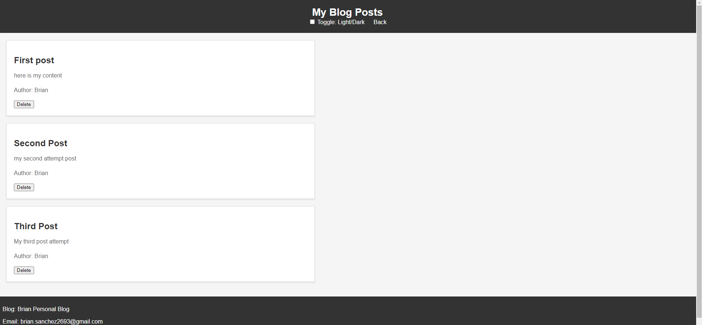

# Blog Post Challenge
## Description

Created a two page personal blog post website where users can input and view blog posts that include the author, title, and content of each post. It includes the delete ability to allow mistaken inputed posts to be erased from the local storage and not returned when page is refreshed. It also includes a toggle light/dark mode check box for the webpage. The blog page also includes a back button to traverse back to the main page to input posts. 

## Link to Deployed Page
https://bds6575.github.io/Brian-Employee-Payroll-Tracker/